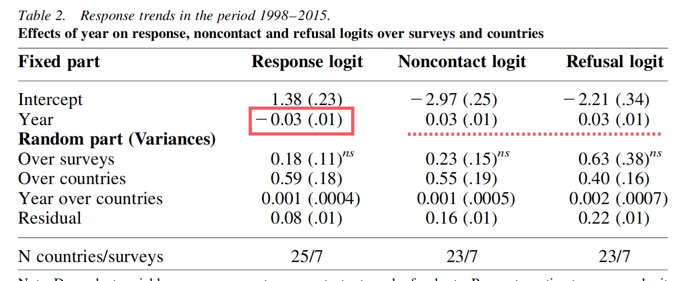
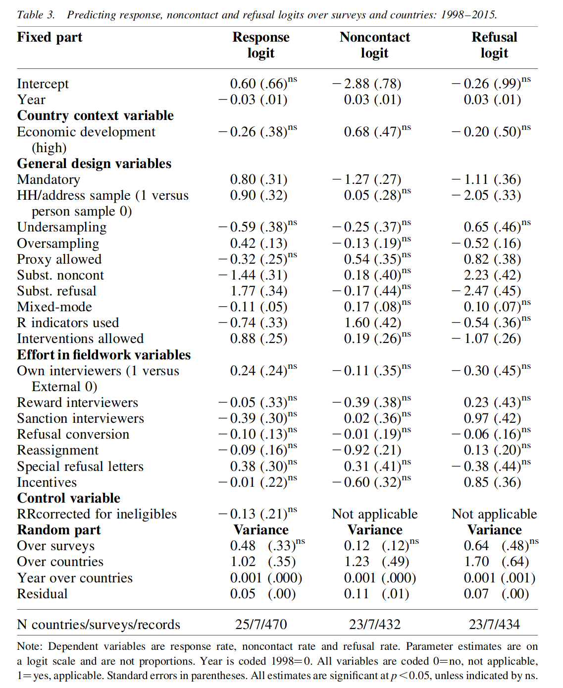

Luiten, Annemieke, Joop Hox and Edith De Leeuw. "Survey Nonresponse Trends and Fieldwork Effort in the 21st Century: Results of an International Study across Countries and Surveys". Journal of Official Statistics 36, 3: 469–87. 

https://doi.org/10.2478/jos-2020-0025.

### 연구 내용:

1998-2015년의 survey non-response trend에 대한 국가 범주에 비교, 차이 연구

### 영향 요인:

- Survey design의 차이
    
- cost indicators
    
    - negatively correlated with **non-contact** rates
        

### 무응답의 문제점:

- threatens the sample selection mechanism
    
- result in longer fieldwork periods.
    
- increased cost per complete interview.
    

### 2 type of Non-response (2가지 무응답):

- refusals [거절]
    
- non-contact [不接触]
    

### Background

1. 대면 조사의 고수준 응답률의 **유지** 보다 전화조사 응답률의 **급감(骤减)**
    

> “Curtin et al. (2005) found that overall response rates for the Survey of Consumer Attitudes were decreasing over time; in addition, they showed that this decrease was partly caused by an increase in refusals and partly by an increase in non-contacts, especially after 1985.” ([pdf](zotero://open-pdf/library/items/HF84NL8L?page=2&annotation=TUYIBZMF)) 🔤 消费者态度调查的总体回应率随着时间的推移而下降；此外，他们还表明，这种下降部分是由于拒绝增加，部分是由于未接触的增加造成的，尤其是在 1985 年之后。

> “The still relatively high response rates of 70– 80% for face-to-face surveys in the United States are in sharp contrast to those for telephone interviews. ([pdf](zotero://open-pdf/library/items/HF84NL8L?page=3)) ”
> 
> **방문조사** 응답률 70~80% 고수준에 유지
> 
> 반면 -> **전화 조사** 응답률 1979~2013년 간
> 
> 72%~13%까지 크게 떨어진다.(Dutwin and Lavrakas 2017 ([pdf](zotero://open-pdf/library/items/HF84NL8L?page=3)) )

2. ESS (European Social Survey)에 대한 연구 결과으로 유럽에서 non-contact 안정적으로 유지하고 있다.즉 non-response rate의 증가에 대해서는 **Refusal**로 귀인한다.
  - ESS: face-to-face survey from 36 European countries
    
    - fielded every 2 years (2년마다 조사)
        
    - covered: 2002~2014
        

> “probably due to the increased fieldwork efforts over the years in many countries for the ESS. Therefore, they attribute the declining response rates in the ESS to the **increase in refusal rates** and conclude that obtaining cooperation has become increasingly difficult over time.” ([Luiten 等, 2020, p. 471](zotero://select/library/items/25ZGVJWS)) ([pdf](zotero://open-pdf/library/items/HF84NL8L?page=NaN)) 可能是由于多年来许多国家为 ESS 增加了实地工作。因此，他们将 ESS 中响应率的下降归因于拒绝率的增加，并得出结论，随着时间的推移，获得合作变得越来越困难。

3. LFS 조사에 대한 연구결과에 따라 non-contact and refusal rate **공동 증가** 추세.  
  - LFS : Labour Force Survey
    
    - 1980~1997 1998~2015
        
    - 국제적인 조사
        

> “The response for the LFS decreased by an average of 0.73% each year. Both the non-contacts and the refusals increased over the total time period, but countries differed in refusal and non-contact rates” ([Luiten 等, 2020, p. 472](zotero://select/library/items/25ZGVJWS)) ([pdf](zotero://open-pdf/library/items/HF84NL8L?page=4&annotation=URJBLDMX)) 🔤LFS 的响应每年平均下降 0.73%。非接触率和拒绝率在整个时间段内都有所增加，但各国在拒绝率和非接触率方面存在差异🔤

### Background IN SUM

- In US
    
    - 전화조사 응답률 급감
        
    - 대면조사 응답률 유지
        
    - non-response rate 감소
        
    - non-response rate 감소 귀인 -> non-contact
        
- In EUR
    
    - non-contact rate 유지 (ESS)
        
- International
    
    - non-contact  and refusal 공동 증가 (LFS)
        
    

### 현존 연구의 부족

- 조사 결과의 보편성 부족
    
- Meta-data(field-word and context)구분되지 않고 non-response과의 연관성 제시하지 않음.
    

이런 부족을 응대하기 위해 이 논문은 이하 4가지의 질문를 밝히려고 한다.

Q.1. In the first two decades of the new millennium, can decreasing response trends in non-contacts and refusals be observed for international surveys, as in the United States?

Q.2. Are these trends generalizable over different surveys or do surveys differ in nonresponse trends?

Q.3. Are these trends different for different countries?

Q.4. Which factors in survey design and fieldwork effort are related to nonresponse trends?

### Methodology

#### 조사 범위

> “25 countries participated, both European and non-European countries: Austria, Australia, Belgium, Bulgaria, Canada, Croatia, Iceland, Finland, France, Germany, Hungary, Italy, Latvia, Lithuania, Malta, the Netherlands, Norway, Poland, Portugal, Slovakia, Slovenia, Sweden, Switzerland, the United Kingdom, and the United States. **All countries provided information on the LFS.”** 

#### 데이터 분석 과정

- non-response 영향하는 변량 (Bethlehem et al. 2011; Biemer and Lyberg 2003; Dillman et al. 2002; De Heer 1999; De Leeuw and De Heer 2002; Groves and Couper 1998; Groves et al. 2004; Stoop 2005; Stoop et al. 2010)
    
    - 거시적 국가 경제 변량
        
    - 연구 기관/인원 조사의 디자인 변량
        
    - fieldwork에서 노력 변량
        

이 논문은 앞 3가지 변량 모델의해 3가지 변량 만들었다.

즉 **independent variable:**

1. 국가 배경 (country context)
    
    - 거시 경제 요인등..
        
2. 일반 설계 (general design)
    
    - 의무 조사 여부 (mandatory?)
        
    - 조사 방식 (대리 허용 여부?..)
        
3. 실지 노력 (effort in field work)
    
    - 조사원의 근무 조건
        
    - 조사원에 대한 격려
        

**dependent variable:**

“Dependent variables were response rate (N ¼ 535), non-contact rate (N ¼ 485), and refusal rate (N ¼ 485).”  🔤因变量是响应率 (N = 1⁄4 535)、非接触率 (N = 1⁄4 485) 和拒绝率 (N = 1⁄4 485)。🔤

### 결과 Results

#### **LFS**와 **기타 사회조사** 조사 데이터 간의 차이성에 대한 분석

- 시간별 추세 차이 없다
    
- intercepts 차이 만 있다
    

#### Q.1 
{style="color: orange"}

  In the first two decades of the new millennium, can decreasing response trends in non-contacts and refusals be observed for international surveys, as in the United States?

  응답률 1998~2015년 보편적으로 하강 추세

  요인 : non-contact and refusal 모두 중가 추세

  

#### Q.2~Q.3 
{style="color: orange"}

  Q.2. Are these trends generalizable over different surveys or do surveys differ in nonresponse trends?  (조사 차이?)

  조사 간의 차이 거의 없어서 즉 보편성 있다.(Q.2)

  Q.3. Are these trends different for different countries? (국가 차이?)

  국가 간의 응답률 차이(intercept) (Q.3) > 조사 간의 차이

#### Q.4 Which factors in survey design and fieldwork effort are related to nonresponse trends? 
{style="color: orange"}

  

  {}
  Table.3: that correlation alone does not imply causality
  {}

  - 거시 경제 요인 <-> response ✖
      
  - filed-work <-> response ✖
      
      - “In the literature, there is ample evidence from experimental studies that show that providing incentives and converting refusals are effective in nonresponse reduction (AAPOR 2014; Singer 2002; Singer and Ye 2013).”  🔤在文献中，实验研究的大量证据表明，提供激励和转变拒绝可以有效减少无反应（AAPOR 2014；Singer 2002；Singer 和 Ye 2013）。🔤
          
      - ！！！ “In our data, not all detail on fieldwork implementations at survey level was available or had a large amount of missing values”  🔤在我们的数据中，并非所有关于调查级别实地调查实施的细节都可用，或者有大量缺失值🔤
          
  - design <-> response ⭕
      
      - mandatory 👆 - response 👆
          
      - filed-work intervention 👆 - response👆
          
      - mixed-mode 👆 - response 👇
          
          - “This is understandable, since a single mode face-to-face survey is known to have the highest response rates (e.g., Bethlehem et al. 2011; Hox and De Leeuw 1994; Stoop 2005).” 🔤这是可以理解的，因为已知单一模式的面对面调查具有最高的响应率（例如，Bethlehem 等人 2011 年；Hox 和 De Leeuw 1994 年；Stoop 2005 年）。🔤
            
    
#### Costs and non-response

#### Costs는 non-contact rate 와 negative 관계 있지만 refusal rate(거절)와 상관 없다.