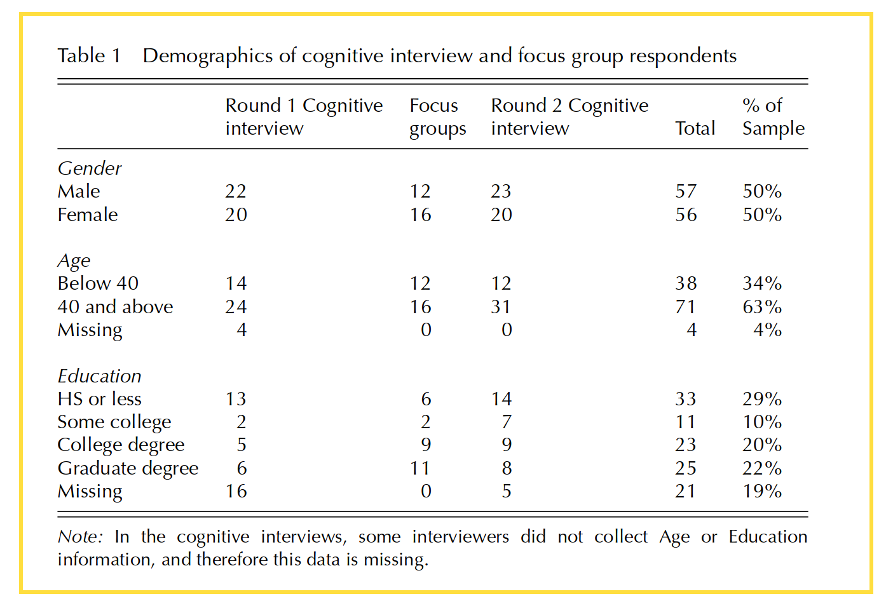
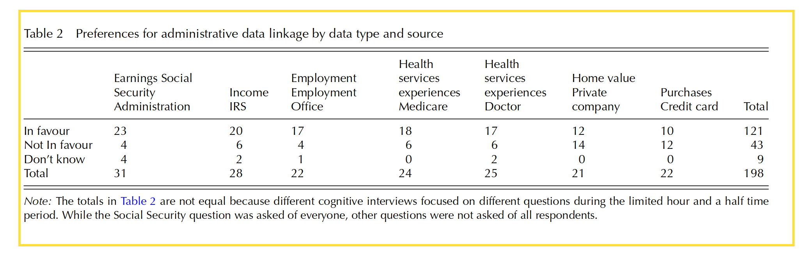
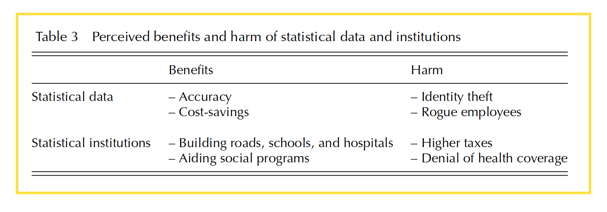

# Abstract

## Article 목적

대중들은 통계에 대한 신뢰의 줄임에 대응하기 위해 Respondents 신뢰할 수 있는 통계 Product 무엇인가? 선택 기준은 무엇인가?의 문제를 밝히려고 한다.

## 조사방법

- Interview
- focus groups

## Result

- 사용 경험 없는 경우
    
    - Culture 가치관
        
        - 개인 자유
        - Coast 절약
        - 사회 공익
- 통계 Product 경험 있는 경우 -> 신뢰 증가

# Review

## 이론 부분

FSS는 미국 연합 통계 시스템, 공식적인 통계 데이터를 수집, 분석, 저장,그리고 발표하는 기관이다. 요즘 통계 기관에 대한 신뢰의 줄임이 조사 대답률의 줄임에도 영향 미쳤다.따라서 조사 비용의 증가및 편차를 초래한다.

이런 신뢰문제 해결하기위해 사람들이 왜 통계기관 신뢰하는가? 왜 신뢰하지 않는다?바탕으로 FSS와 NSO가 조사를 시작한다. 공식 통계 신뢰 모델도 축진된다.

“This international effort was responsible for the development of a model of trust in official statistics, as detailed by Ivan Fellegi (2010),” (Smirnova 和 Scanlon, 2017, p. 220)

이 모델은 **“Fellegi Model”**라고 부른다.

조사기관와 조사 Product 따로 구분하여 태도를 측정하는게 특징이다.

**Trust based on experiences or culture (abstract principles)**

“Aryeeet al., 2002). Luhmann (1979) argues that system trust is built up by continual affirmative experiences using the system.” (Smirnova 和 Scanlon, 2017, p. 221) Aryee 等人，2002 年）

즉 지속적인 시스템에 대한 경험이 사람의 주관 불확실성을 줄이다.

 

그 반대 기든스는  *institutional trust*  완전 경험에 의뢰하는 게 아니다고 했다.

기든스는  *institutional trust가 abstract principles* 에 의하는 것을 제시했다.

이상 이론간의 차이는

경험바탕 모델은 인간서로의 연결과 저극적인 공유 경험에 의하는 것이며 문화바탕 모델은 서로 익숙하지 않은 공통이익을 추구하는 환경에서 적용한다.

이 두가지의 모델다 FSS에 대한 태도를 영향을 미치고 있다.

 

**“Mizrachi et al.’s (2007) ‘trust repertoires”**

(trust as **strategies of action 선택로서의 신뢰**  )

3 interrelated dimensions that practice of trust:

- agency
    
    - 행동자 자체의 신뢰 전략 선택
- culture
    
    - 문화 패턴의 선택
    - as symbols , practices from which trust form are selected
- power
    
    - 권력 , 선택의 (sanction)제한

[同 “Drawing from Swidler’s (1986) cultural toolkit”]

 

## 방법론및 데이터
- qualitative (질적)
    
    - interviews
    - focus groups
    
- 특히 경험과 문화바탕의 신뢰 초점

질적 방법 선택한 이유는 조사문제 뒤에 깊게 숨어 있는 인지 과정을 찾기 위한때문이다.

**Interview 연구 단계:** (p.222-223)

1. interview
    - [respondents how to understand, process. then answer a survey question]
2. compare
    - [compare respondent’s answer with survey question they answered ]
3. analysis
    - [compare all of respondents’ answers, find the answer pattern. created structure]
4. sub-grouping (compare of patterns)
    - [identifying patterned differences among sub-group]

**Focus group 연구 방업:**(p.223-224)

“‘explicit use of group interaction’”

개인 의견(생각) -> 개방 토론

- 그룹 분류 기준
    - 센선스 (Census)에게 정보 공유할 태도  의해
    - 공유 가능할 정보종류 의해
        - 정보 수집 from me ?의 종류
        - 정보 수집 from another ?의 종류

1차 이터뷰의 귀납의해 Focus group 산정

구성원:

- **semi-homogeneous**
- 연령
- 교육정도
- 사회경제지위
    

**demographics of respondents:**

(Smirnova 和 Scanlon, 2017, p. 224)

 

## 발견 Findings

**1차 인터뷰**

- respondents 통계 Product에 대한 이해정도
    
    - 아는 통계 기관/ 제품
        
        - 경험 <-> 신뢰관계 확정
        - “Familiarity can both create trust when the experience was favourable and ruin trust when it is not. Familiarity reduces uncertainty by creating ‘relatively reliable expectations’ (Luhmann, 1979: 19).”
            
-  익숙하지 않은 기관에 대한 태도 [데이터를 기관내 직접 수집]
    
    - 데이터 저장의 안전성아닌 경험에 있는 데이터 Privacy 합법적으로 파괴된 장면을 연상
        
        - “one survey question asks whether respondents believe the following statement to be true: ‘Information collected to create federal statistics is sometimes used by the police and the FBI to keep track of people who break the law.’ Many respondents were not thinking of statistics as much as they were thinking about the government accessing people’s personal files or police records. They cited examples such as ‘terrorist’ and ‘sexual predator lists’, ‘travel records’ (such as airline tickets), and ‘personal files’ (one person talked about how the government kept a large file on John Lennon).”
            
              
            (Smirnova 和 Scanlon, 2017, p. 228)
            
    - **데이터의 용도,Data privacy + 기관에 대한 경험**
        
        구체적인 **culture model** 요소:
        
          
        (Smirnova 和 Scanlon, 2017, p. 229)
        

**Focus group**

경험의 불신뢰 영향 > 문화 모델 신뢰

- 경험적
    
    - ‘For profit‘영익적 기관에 대한 불신뢰
        
        - 부정적 경험
            
            - 메일 주소등 개인 정보 노출
            - …
    - 의료 기관에 대한 찬성 (신뢰)
        
        - “Respondents believed that there could be personal and societal benefits if such entities shared health information.” (Smirnova 和 Scanlon, 2017, p. 231)
- 문화 모델적
    
    - **정확한** 데이터 수치
    - 사회 공익
        
        - 취약계층에 대한 발견+지지
        - 공통 가치관: 사적 공적 의료기관
    - 코스트(Coast) 절약

**2차 인터뷰**

문화모델바탕

- 코스트
    
    - 통계 실시의 시간
    - 돈
    - 정력
- 사회공익
    
    - Policy
    - 정치 성과
        

## 결론

신뢰 결정 모델:

통계 기관에 대한 신뢰 -> **경험 바탕**

- 제재의 우려
- 코스트 절약

통계 Product에 대한 신회 -> **문화 모델**

- 데이터의 정확도
- 공익성

마지막

문화의 복잡성 고려하야한다!
