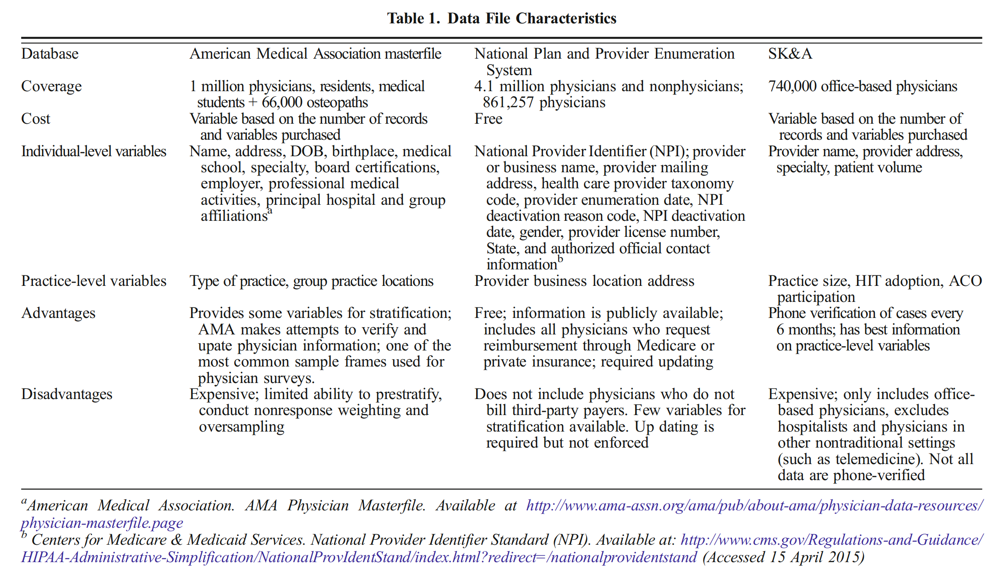
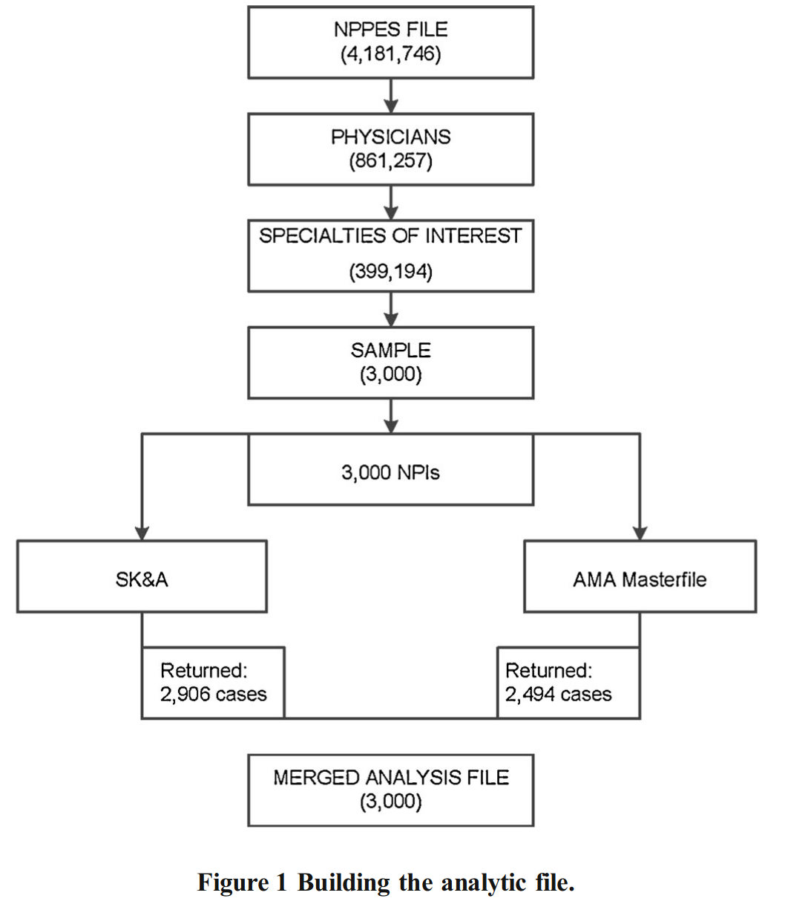
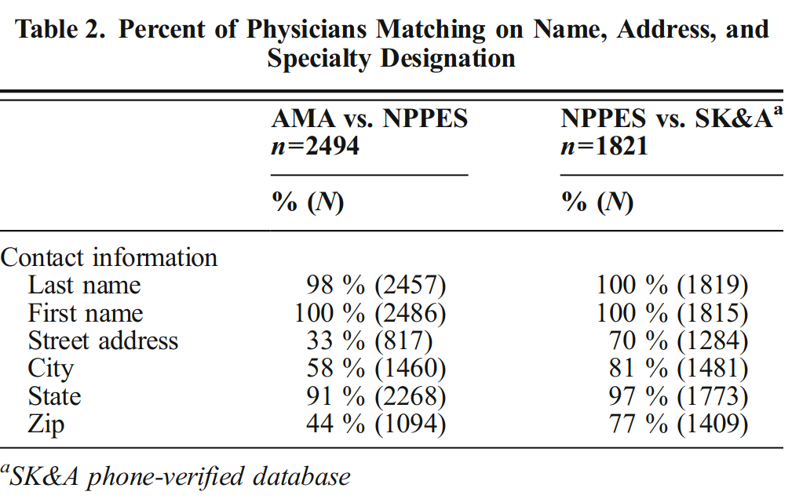
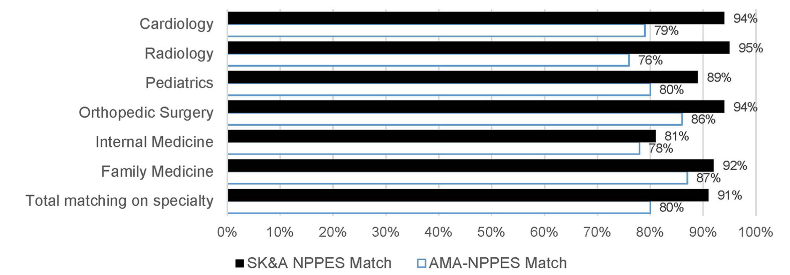

DesRoches, Catherine M., Kirsten A. Barrett, Bonnie E. Harvey, Rachel Kogan, James D. Reschovsky, Bruce E. Landon, Lawrence P. Casalino, Stephen M. Shortell, and Eugene C. Rich. "The results are only as good as the sample: assessing three national physician sampling frames." Journal of general internal medicine 30 (2015): 595-601

DOI: 10.1007/s11606-015-3380-9

### 논문 목적:

> “compare the National Provider and Plan Enumeration System (NPPES), the American Medical Association Masterfile and the SK&A physician file.” 

3가지의 의사 데이터베이스간의 차이. (샘플 연구 위한) 정보의 확실성과 포함 범위 검증.

### 배경:

현존 Sampling frames의 다당성은 샘플 의사 조사의 대표성과 편차에 영향을 미친다.

problem:

- 도달범위 부족 (Under coverage) or
- Over coverage [퇴직 의사 포함됨..]
- 오류 정보 Error information … 중복정보 Duplicate information …

#### 기관 배경:

NPPES:

- 요금 청구서 계산 -> 주소 Update 동기 있음

CMS:

- 주소 변경 요구 -> 실행력 없음

AMA:

- 기관은 의사 정보 Update노력 -> 의사 자체 정보 갱신 의도(필요)없음

SK&A:

- 의사,병원..정보 포함, 6개월마다 정보 검증

### 분석 과정:

NPPES FILE에서 의사 데이터 뽑아서 6가지의 과의 의사으로 제한하여 각 과마다 500명 샘플해서 총 3000명 샘플로 SK&A와 AMA에게 검증. 매칭한 의사 한 파일(NPPES)로 Combine하고 전화를 통해 주소 검증.

### 결과:

SK&A -> 97% matching (2906) -> 63%전화검정 통과

AMA -> 83% matching (2494)

3가지기관 (공통)매칭 의사 데이터 : 55%(1655명)

**전공 포함 편차:**

[큰 차이 없음] NPPES F <--> AMA :

- famliy medicine physicians, radiologists , cardiologist : 82%
- pediatricians : 86%

[편차 큼] NPPES F <--> SK&A :

- radiologist : 50%
- cardiology : 72%

**주소 매칭:**

4가지 변수 : (address, city, state, and zip code)

3가지기관 공통 매칭 rate : 33 %

two-way comparisons:

**전공 매칭 정확성:**

3가지기관 공통 매칭 rate : 78 %

NPPES <--> AMA : 80%

NPPES <--> SK&A : 91%

**주소 매칭 정확성:**

- SK&A : 85%
- NPPES : 86%
- AMA : 42%

### 결론:

- AMA
    
    - 정보 정확성 낮음
- SK&A
    
    - Hospital-based physicians에 편향
- **NPPES**
    
    - 포함 범위 제일 좋음
    - extra information 상대적 부족
        
        - 다른 DB와 연합사용